# 🎉 Credenz  
*Tech Fest Website for PICT IEEE Student Branch*

Credenz Live is a **dynamic and visually engaging tech fest platform** built for the PICT IEEE Student Branch.  
The project handles **online event registrations, authentication, event cart & payments**, and provides an interactive experience for users and admins alike.  

During the 2020 COVID-19 pandemic, the platform successfully managed **1000+ user registrations**, showcasing its robustness and scalability.  

---

## ✨ Highlights

- 🧩 **Full-stack web application** with React frontend and Node.js backend  
- 🔐 **JWT-based authentication & authorization**  
- 🎨 **Visually rich UI** with dynamic animations and themed interactions  
- 🛒 **Event cart & payment flow** using IppoPay  
- 👁️ **Vision-themed homepage** with interactive landing page animation  
- 🤖 **Interactive robot annimation** inspired by computer vision  
- 📄 **About Us & Feedback forms** for user engagement  
- 🚀 Successfully managed **1000+ registrations during COVID-19** 

---

## 🛠️ Tech Stack

### Frontend
| Technology | Role |
|----------|------|
| React.js | Component-driven UI |
| JavaScript / TypeScript | Application logic |
| CSS / SCSS / Tailwind | Styling & animations |
| Axios | REST API communication |

### Backend
| Technology | Role |
|----------|------|
| Node.js | Backend runtime |
| Express.js | REST API framework |
| JWT | Secure authentication & authorization |
| Nodemailer | Email notifications & confirmations |

### Database & Infra
| Technology | Role |
|----------|------|
| MongoDB | User, event & registration data |
| NGINX | Reverse proxy & deployment |
| IppoPay | Event registration payments |
| Git & GitHub | Version control |

> Designed as a **scalable full-stack system** with clear separation of concerns between frontend, backend, and infrastructure.

---

## 🎶 Features

### 🔐 Authentication & Authorization
- Secure signup & login using JWT  
- Protected routes for authenticated users  
- Session handling across pages  

### 🎟️ Event Registration & Payments
- Browse available events  
- Add events to cart  
- Checkout via IppoPay (disabled in demo)  

### 🎨 Visual & Interactive Experience
- Homepage with **animated eye (vision theme)**  
- Events page robot scanning events  
- Smooth page transitions & hover effects  

### 📣 Communication & Engagement
- Email confirmations using Nodemailer  
- Feedback form for participants  
- Informational About Us section  
---

## 🎬 Demo GIFs

**Homepage Animation**  
  

**Events Robot Scan**  
  

> Payments via IppoPay are **disabled in demo version**. 

---

## 🖼️ Screenshots

**Home**
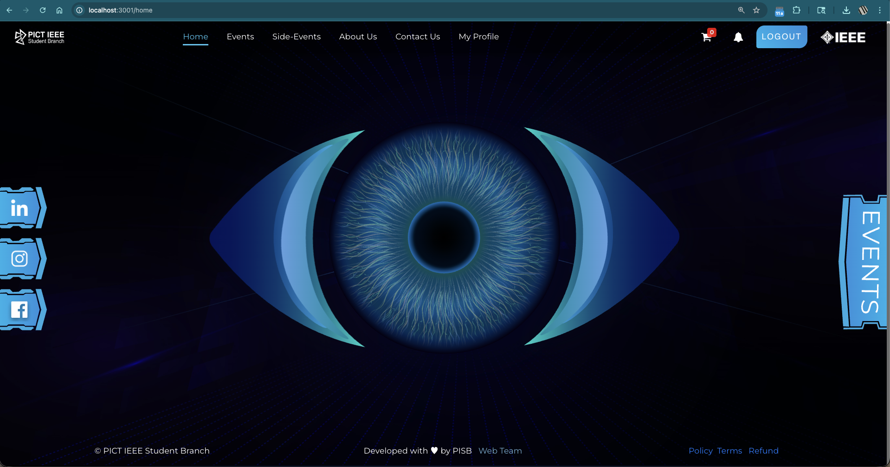  
**Events**
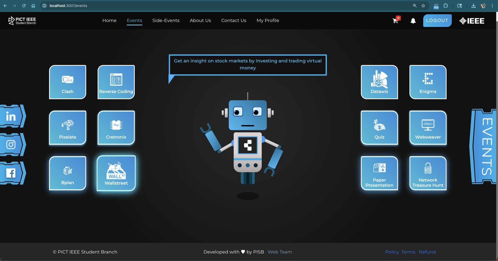  
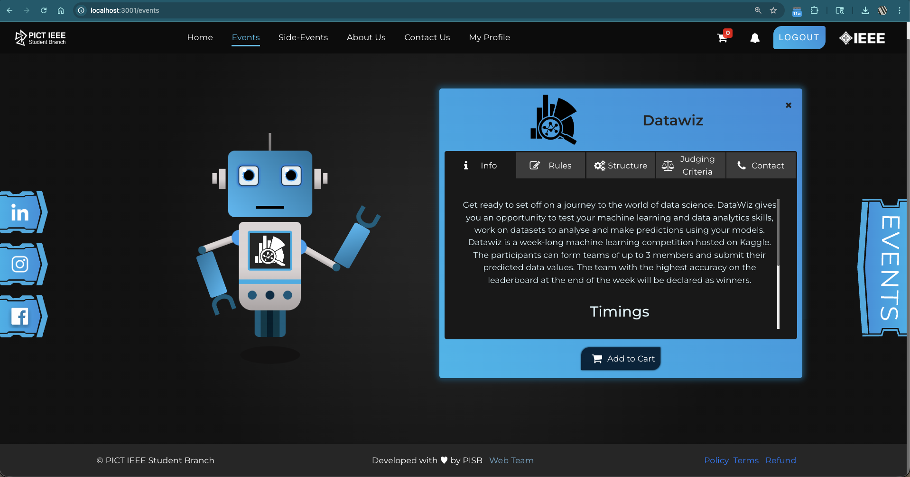  
**Side Events**
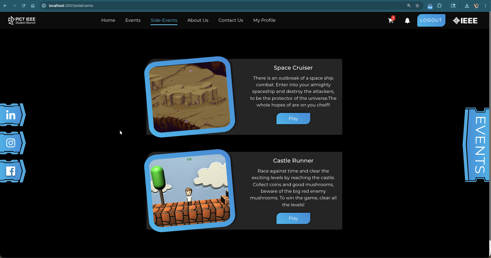  
**About Us**
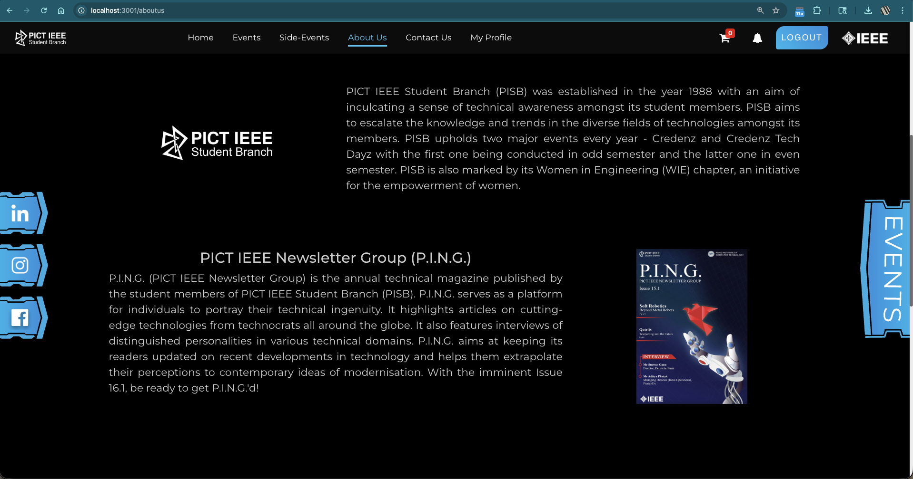  
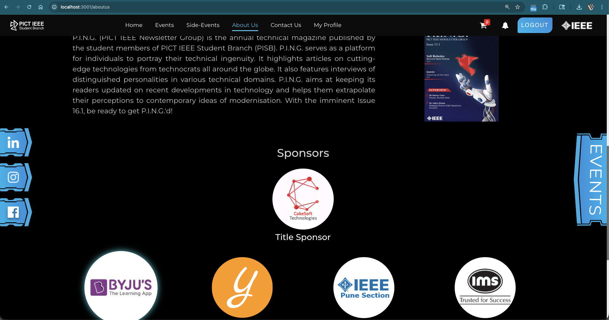  
**Contact Us**
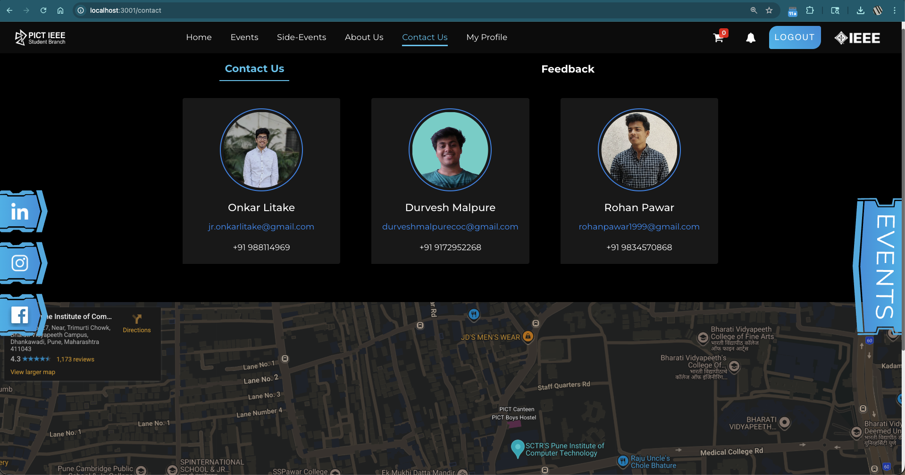  
**Feedback Form**
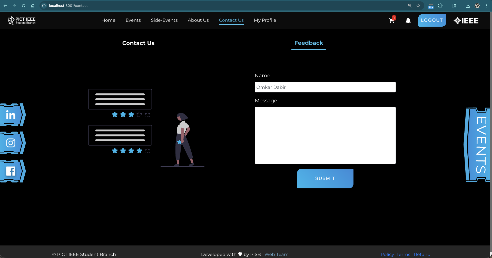  
**My Profile**
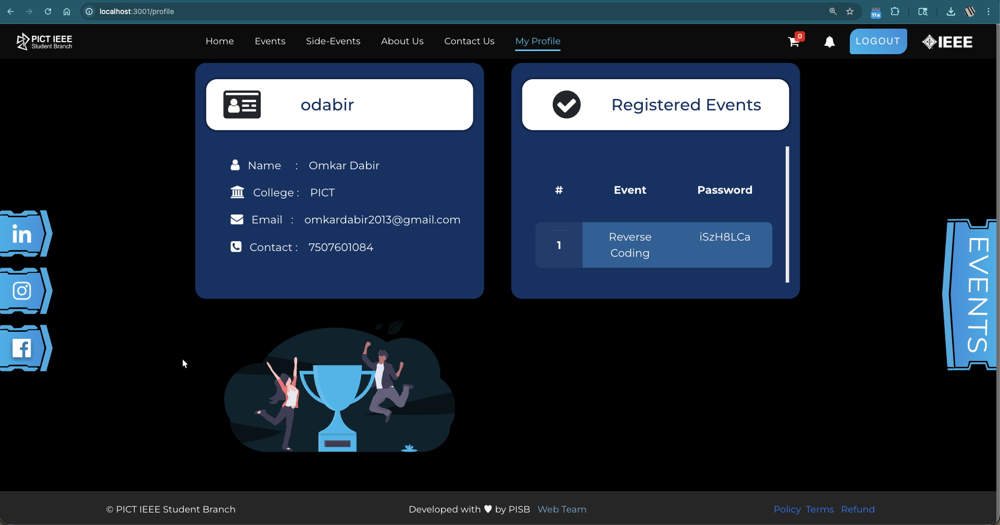  
**Cart**
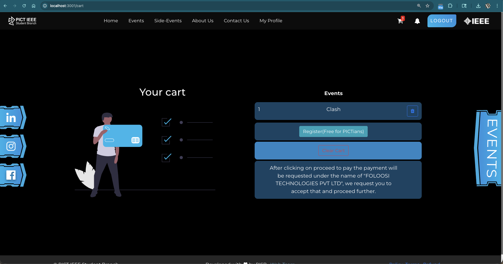  
**Team**
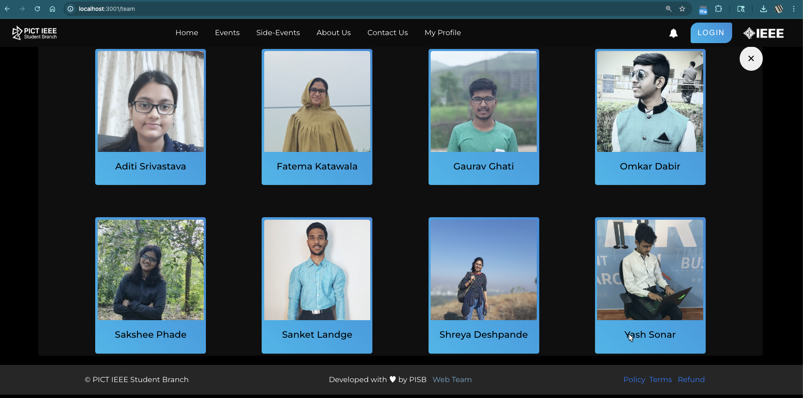  

**Mobile Views**

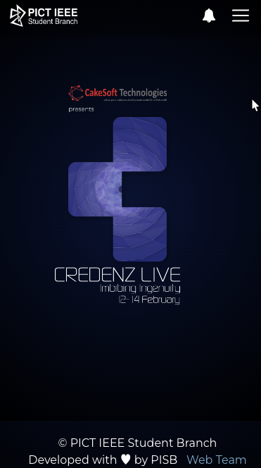
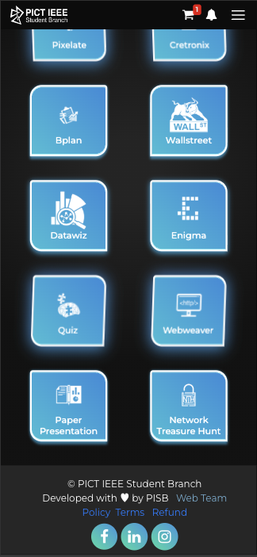
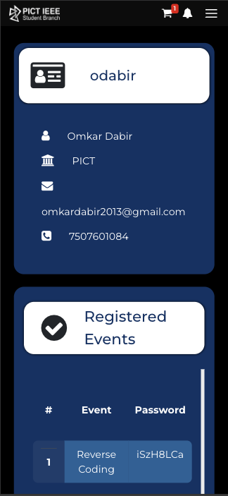

---

## 🎯 What This Project Demonstrates

- Building **end-to-end full-stack applications**  
- Designing **secure auth flows using JWT**  
- Integrating **payment gateways and email services**  
- Deploying with **NGINX and MongoDB**  
- Crafting **creative, themed UI experiences**  
- Handling **real-world scale under pressure**

---

## ⭐ Acknowledgements

Built for **PICT IEEE Student Branch** and inspired by **creative tech fest experiences**.  
Designed to provide **fun, interactive, and memorable digital engagement** for participants.
